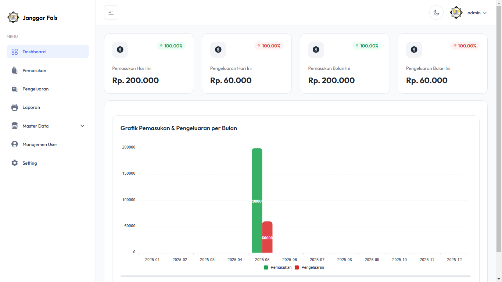
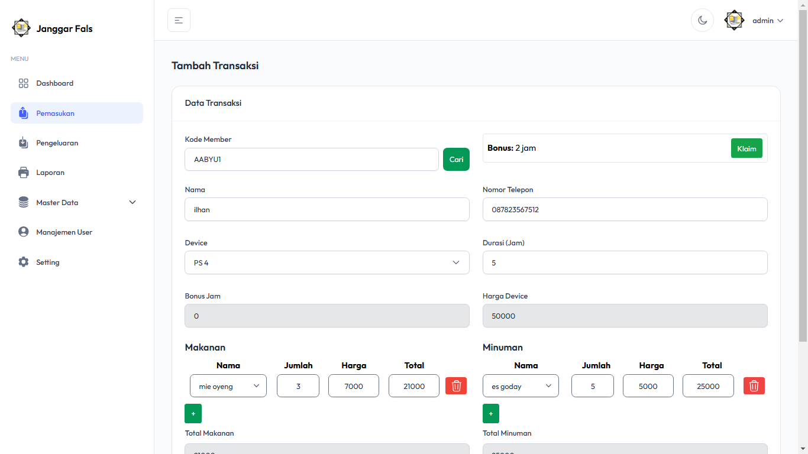
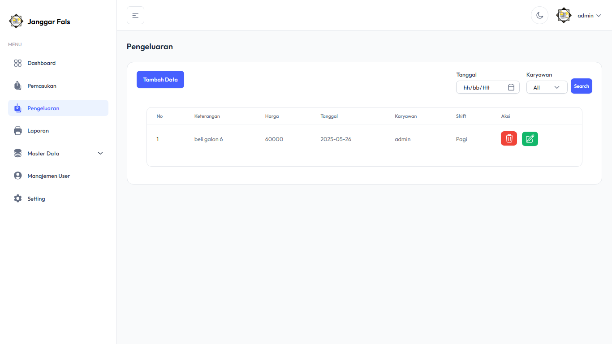

# 💸 Sistem Keuangan Rental PS

Sistem Keuangan Rental PS adalah aplikasi web berbasis Laravel 11 yang dibuat untuk membantu mengelola transaksi keuangan harian dari rental PlayStation. Aplikasi ini dirancang dengan antarmuka modern menggunakan Tailwind CSS dan template TailAdmin, agar mudah digunakan oleh pemilik usaha rental.

## 🚀 Fitur Utama

-   📅 Pencatatan transaksi harian (pemasukan & pengeluaran)
-   💰 Rekapitulasi keuangan bulanan
-   📊 Dashboard statistik keuangan
-   🔍 Filter dan pencarian transaksi
-   👥 Manajemen pengguna dan otorisasi akses

## 🛠️ Teknologi yang Digunakan

-   [Laravel 11](https://laravel.com/) – Backend framework PHP
-   [Tailwind CSS](https://tailwindcss.com/) – CSS Utility-first
-   [TailAdmin Template](https://tailadmin.com/) – Template dashboard admin modern berbasis Tailwind

## ⚙️ Cara Install & Menjalankan Aplikasi

### 1. Clone Repository

```bash
git clone https://github.com/ilhanmanzis/sistem-keuangan-rental-ps.git
cd sistem-keuangan-rental-ps

```

### 2. Install Dependency

```
composer install
npm install
```

### 3. Konfigurasi Environment

```
cp .env.example .env
php artisan key:generate
```

Edit file .env, contoh:

```
DB_CONNECTION=mysql
DB_HOST=127.0.0.1
DB_PORT=3306
DB_DATABASE=rentalps
DB_USERNAME=root
DB_PASSWORD=
```

### 4. Migrasi Database dan Seeder

```
php artisan migrate --seed
```

### 5. Jalankan Aplikasi

```
php artisan serve
```

## ⚠️ Catatan Penting

Jika Anda mengalami kendala atau error saat menjalankan aplikasi ini, silakan hubungi saya melalui:

-   📧 Email: [janggarfals1207@gmail.com](https://mail.google.com/mail/?view=cm&fs=1&to=janggarfals1207@gmail.com)
-   📱 WhatsApp: [+6281282544112](https://wa.me/6281282544112)

## 📸 Screenshot







